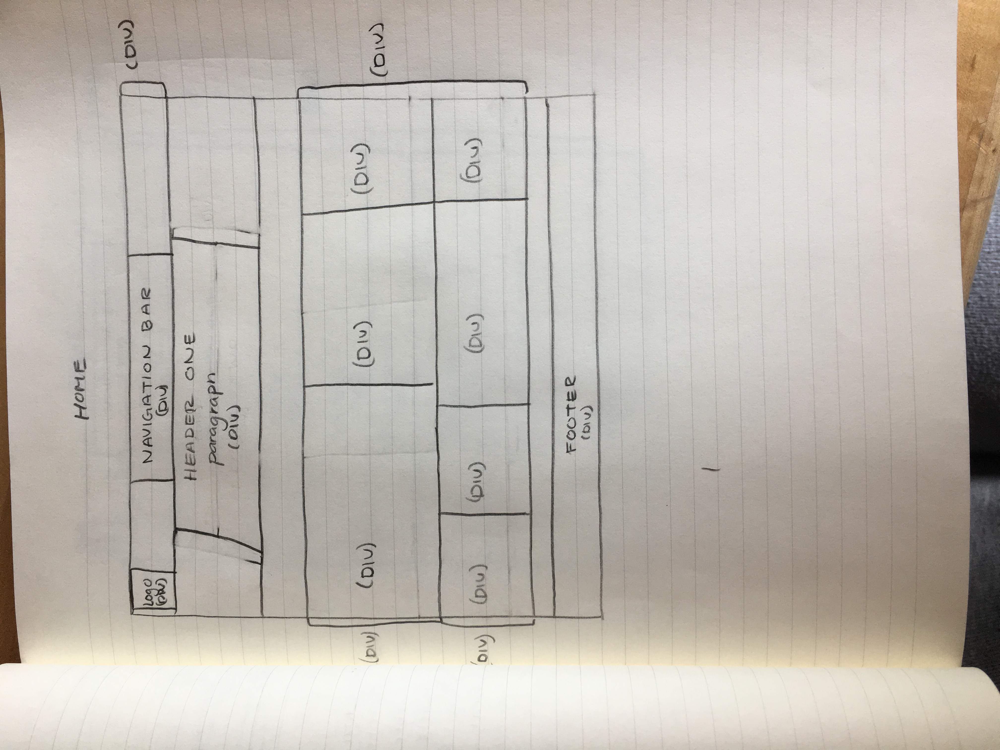
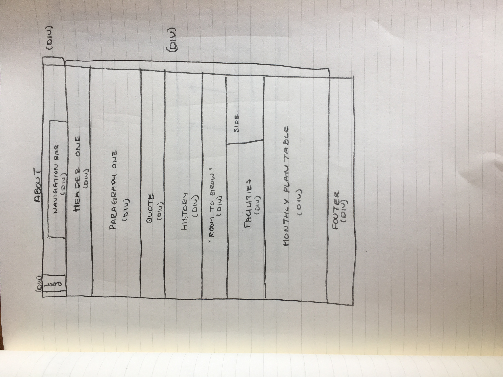
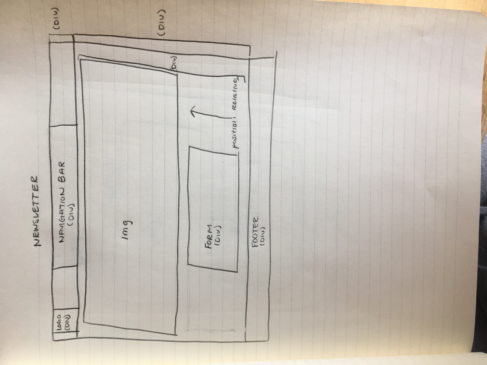
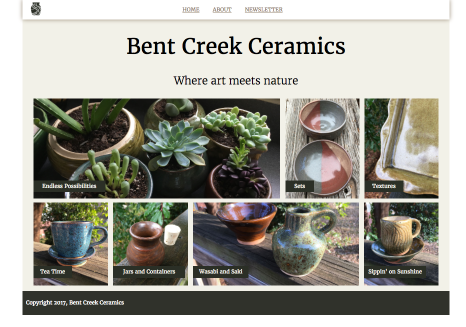
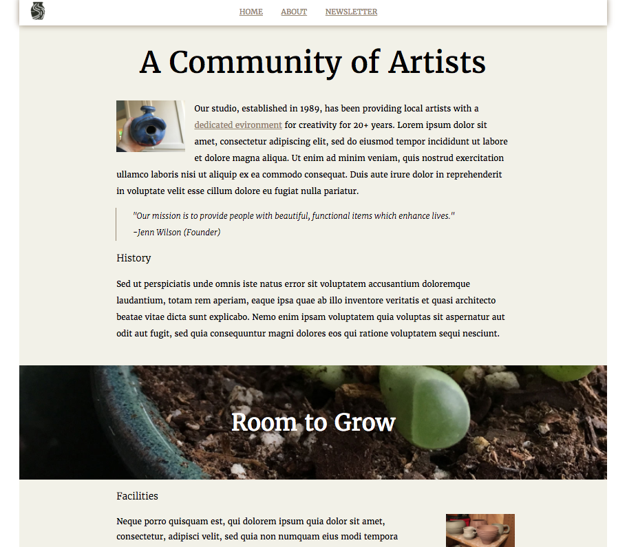
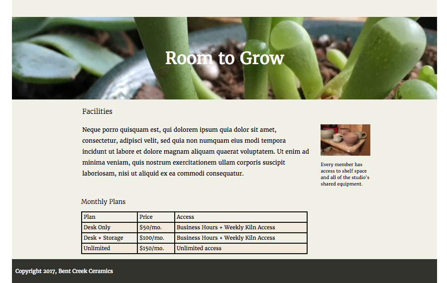
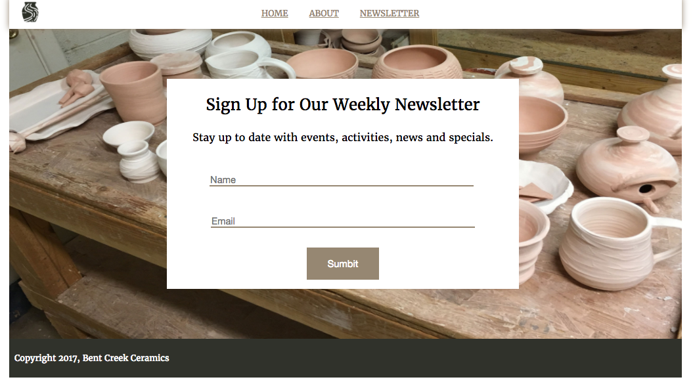

## Week One Project
- HTML
- CSS

## Steps
- Began by writing the HTML for the "home page"
- I then styled it with css and did roughly 75% of the styling
- Next I wrote the HTML for the "newsletter page"
- I again styled it with css and did roughly 75% of the styling
- After that I wrote the HTML for the "about page"
- Then I styled it with css and did roughly 75% of the styling
- After I began styling all three pages and would switch back and
forth when I cam across an issue I could not figure out

## CSS Used
- parallax
- display flex
- float
- display block
- background-image
- position relative
- flex-direction
- flex-basis
- line-height
- border-style
- padding
- justify-content

### Home Page Wireframe

### About Page Wireframe

### Newsletter Page Wireframe

### Finished Home Page

### Finished About Page

### Finished About Page

### Finished Newsletter Page

